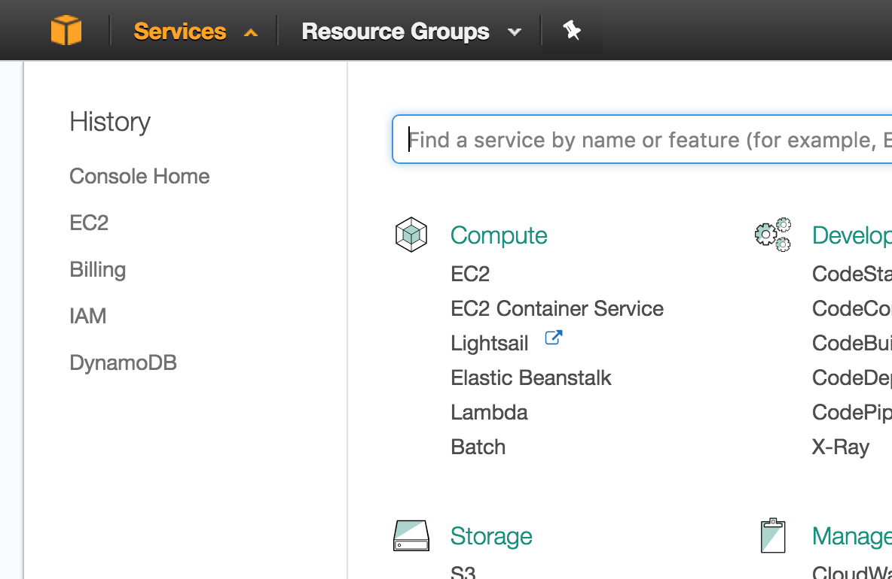

# Setting up a cloud environment
+ Basic setup
  + Creating an Ubuntu instance
  + Setting up port permissions
  + getting a static IP
  + sshing in
+ Adding Mosquitto
+ Adding node-red
  + Simple setup
  + Securing it (vital)

---

# Creating an Ubuntu instance

+ Log in to AWS [here](https://console.aws.amazon.com/console/home)

