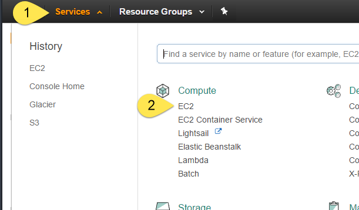
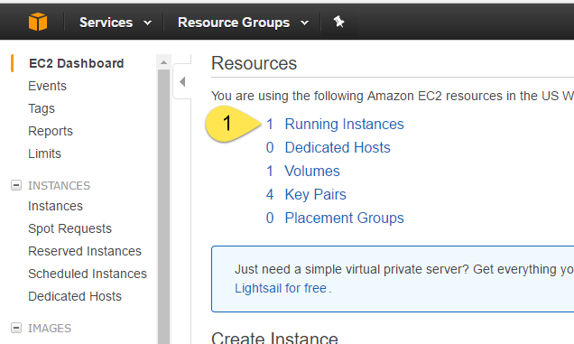
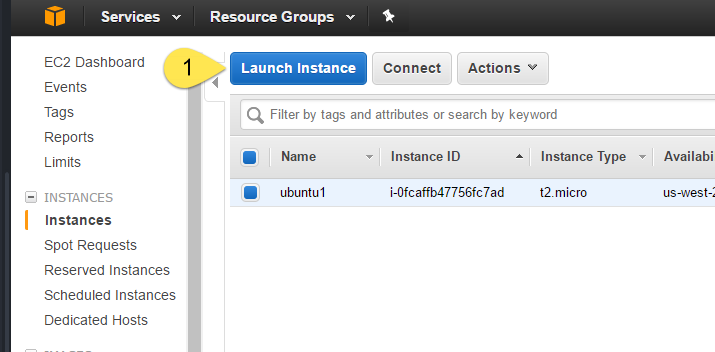
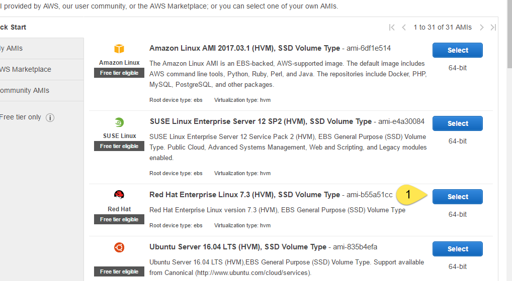
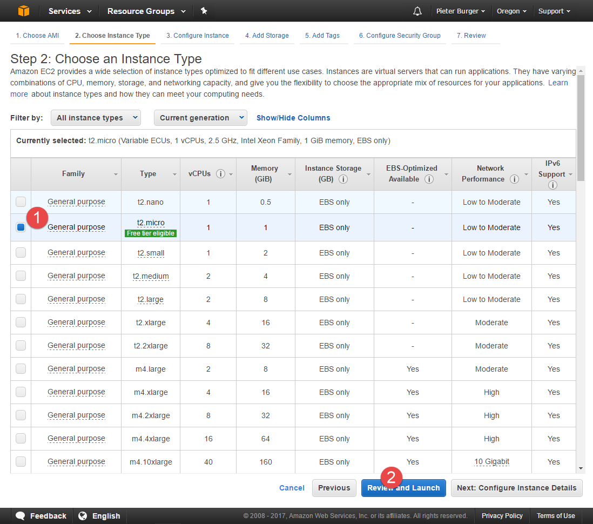
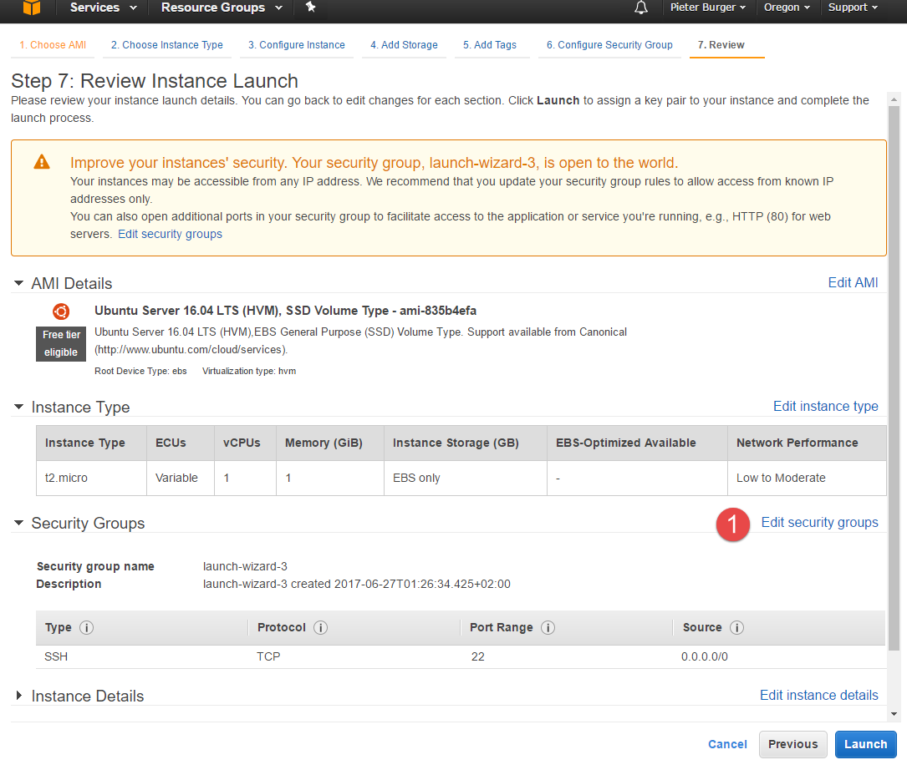
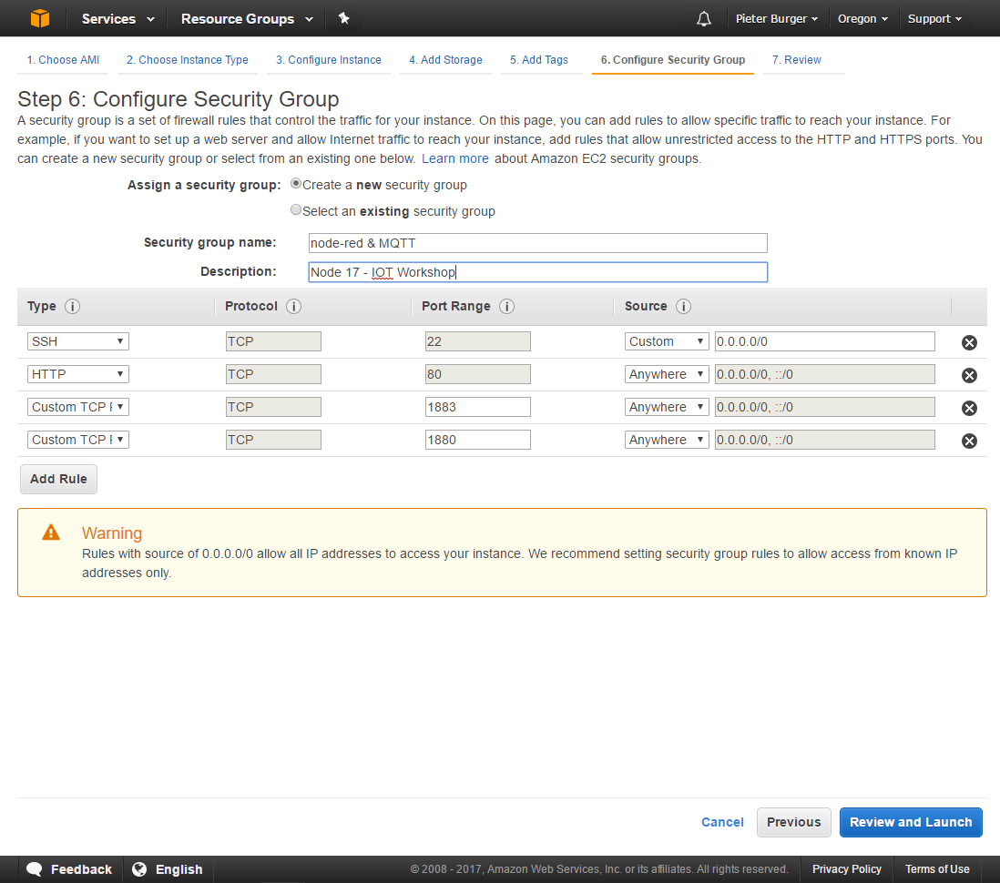

# Setting up a cloud environment
+ Basic setup
  + Creating an Ubuntu instance
  + Setting up port permissions
  + getting a static IP
  + sshing in
+ Adding Mosquitto
+ Adding node-red
  + Simple setup
  + Securing it (vital)

---
class: middle, center

# Creating an Ubuntu instance

---

Log in to AWS Management console [here](https://console.aws.amazon.com/console/home)
and browse on over to the Elastic Cloud Compute service

.right[Creating an Ubuntu instance]

---

open up the running instances page

.right[Creating an Ubuntu instance]

---

Hit Launch instance

.right[Creating an Ubuntu instance]

---

Select the Ubuntu Server
(Ubuntu Server 16.04 LTS (HVM), SSD Volume Type - ami-835b4efa as of writing)

.right[Creating an Ubuntu instance]

---

Choose the t2.micro (its the only free one) and hit review and launch

.right[Creating an Ubuntu instance]

---

Choose Edit security groups

.right[Creating an Ubuntu instance]

---

Set it up like so

.right[Creating an Ubuntu instance]

---

.right[Creating an Ubuntu instance]

---

.right[Creating an Ubuntu instance]

---

.right[Creating an Ubuntu instance]

---

.right[Creating an Ubuntu instance]

---

.right[Creating an Ubuntu instance]

---

.right[Creating an Ubuntu instance]
