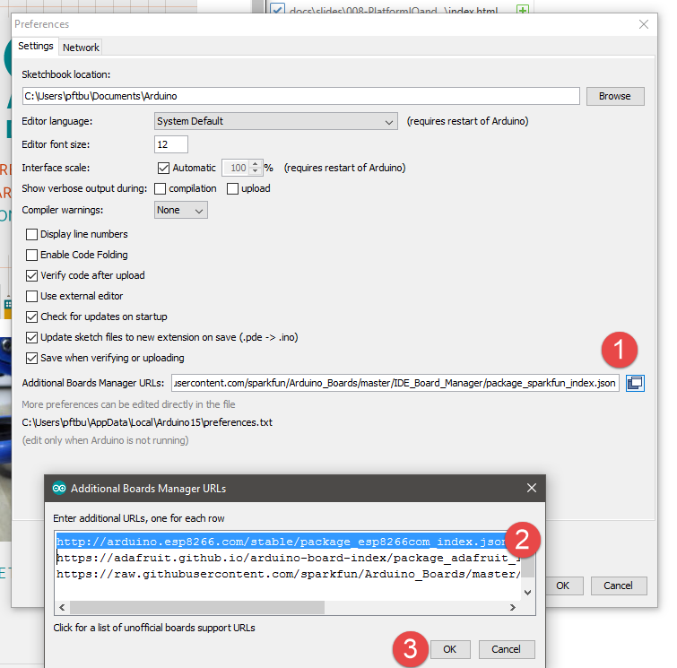
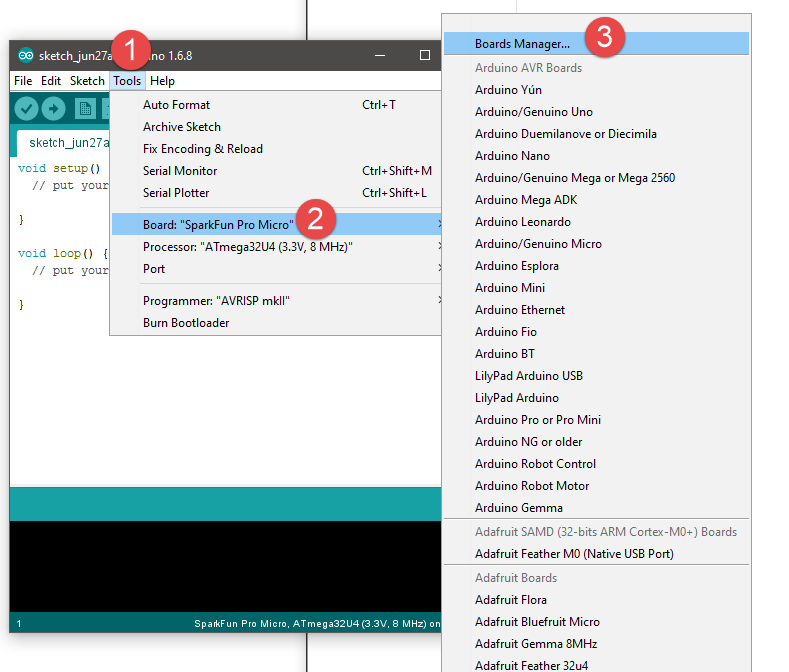
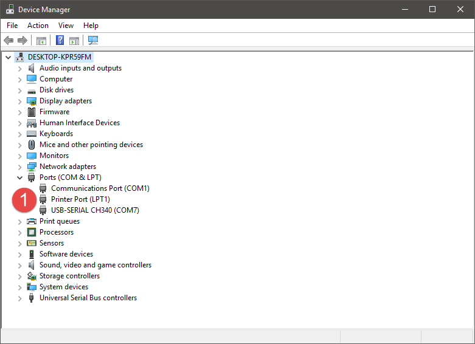

# The ESP8266 & The Wemos D1 Mini

+ [Setup](#setup)
  + Adding the board to the board manager
  + Settings
  + Pushing your first sketch - Blinking the LED
+ Using the ESP with other things
  + [Button Shield](#button-shield)
  + [WS2812B RGB Shield](#ws2812b-rgb-shield)
  + [Motor Shield](#motor-shield)
  + [Ultrasonic Distance](#ultrasonic-distance)
  + [OLED](#oled)
  + [Analog Sensors](#analog-sensors)
    + Photo resistor (LDR)
    + IR Reflectance

---
class: middle, center

# Setup

---

+ If you haven't already, download the Arduino IDE

---

Under file, select preferences
under aditional boards, enter

`http://arduino.esp8266.com/stable/package_esp8266com_index.json`

and say OK

---

---

---
