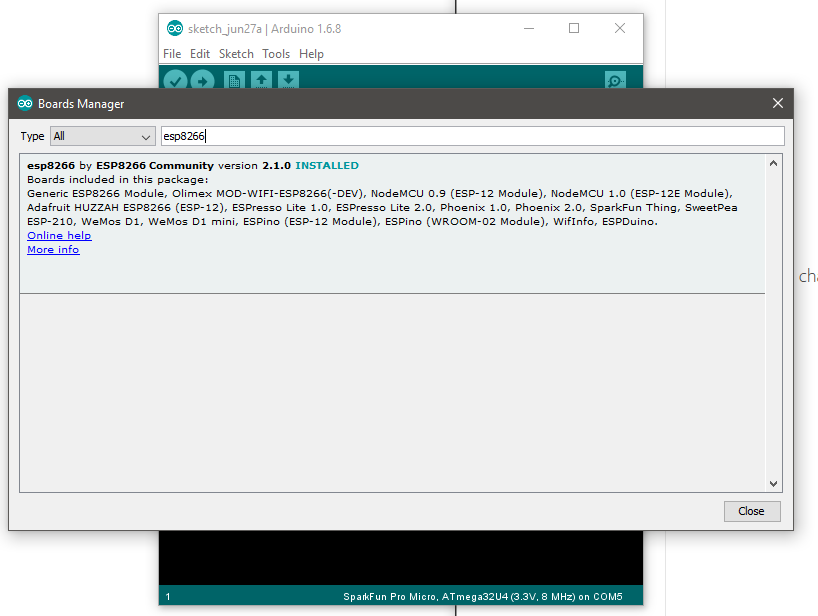
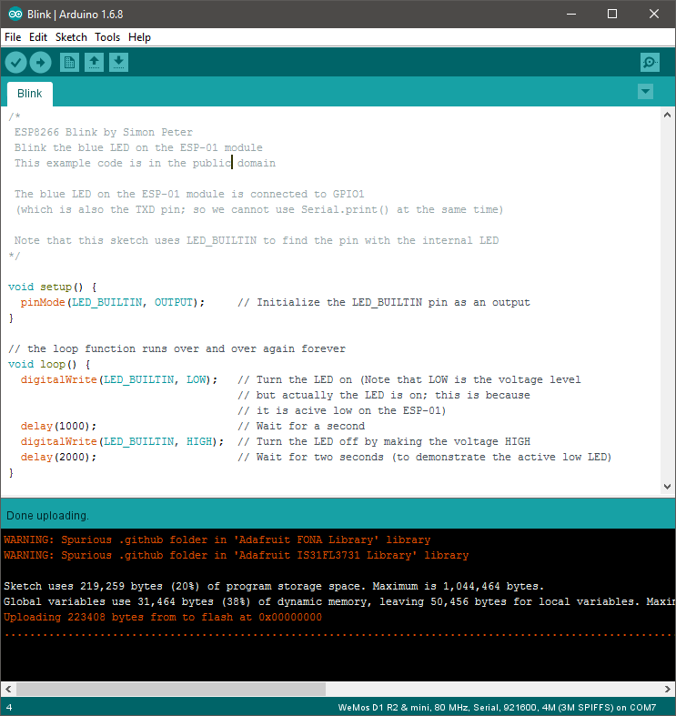
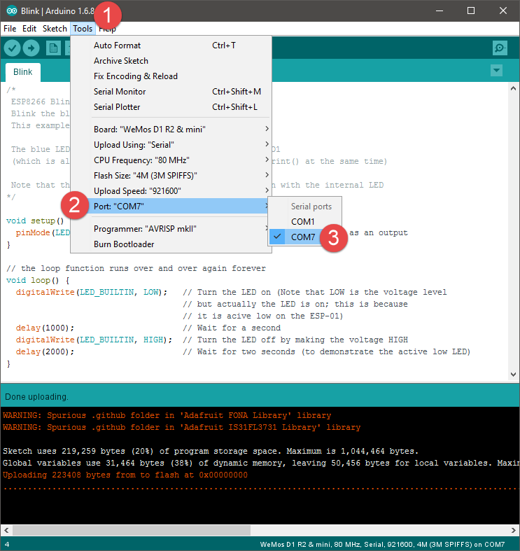
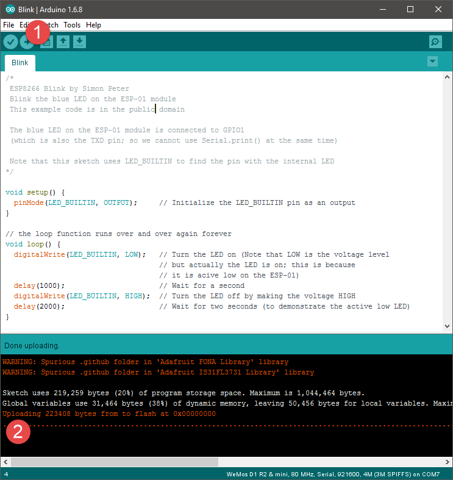
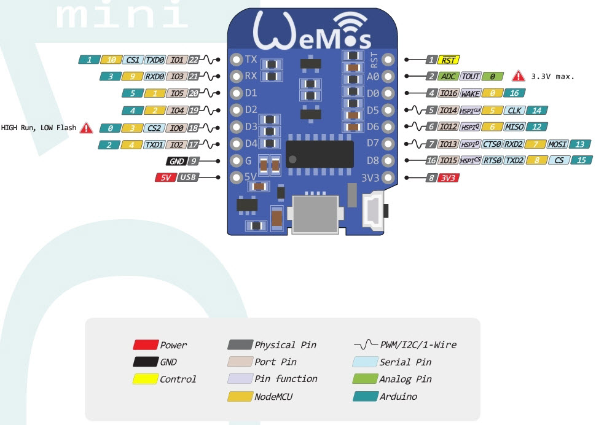

# The ESP8266 & The Wemos D1 Mini

+ [Setup](#setup)
  + Adding the board to the board manager
  + Settings
  + Pushing your first sketch - Blinking the LED
+ Using the ESP with other things
  + [Pinout](#pinout)
  + [Button Shield](#button-shield)
  + [WS2812B RGB Shield](#ws2812b-rgb-shield)
  + [Motor Shield](#motor-shield)
  + [Ultrasonic Distance](#ultrasonic-distance)
  + [OLED](#oled)
  + [Analog Sensors](#analog-sensors)
    + Photo resistor (LDR)
    + IR Reflectance

---
class: middle, center

# Setup

---

+ If you haven't already, [download the Arduino IDE](https://www.arduino.cc/)

---

+ Under file, select preferences
+ under aditional boards, enter

`http://arduino.esp8266.com/stable/package_esp8266com_index.json`

+ and say OK

---

+ Under Tools select board and then Bard manager

---

+ Search for esp8266
+ and install it

---

+ While thats installing, lets go get the [USB Serial Bridge Drivers](https://wiki.wemos.cc/_media/file:ch341ser_win.zip)

.center[# GIANT WARNING]

.center[# Do Not use the Mac driver on macOS Sierra]

.center[# Its unsigned and will cause kernel panic]

+ On mac, use [these](https://blog.sengotta.net/signed-mac-os-driver-for-winchiphead-ch340-serial-bridge/) drivers instead

+ if you fell into that trap, [here](https://tzapu.com/ch340-ch341-serial-adapters-macos-sierra/) is how to fix it

---

+ Lets send a super simple sketch just blinking the onboard LED to confirm it works
+ There are plenty examples, just open the blink sketch

---

+ Select the Comport your device is connected to

---

+ and hit the upload arrow
+ it will compile, and upload the code to the board
+ during the upload process the blue LED should flash rapidly

---

# Using the ESP8266 with other things

---

## Pinout

